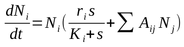
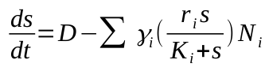

# generalized Lotka-Volterra modelling
Modelling (microbial) communities with generalized Lotka-Volterra dynamics. Two alternate forms of the equation are used, termed here as *simple gLV* and *gLV with carrying capacity* or *gLV with K*

#### simple gLV

Where:
- i = species i in group of species
- Ni = species i abundance
- Left side of equation = change of species i abundance per unit of time
- ri = intrinsic growth rate of species i
- Ai<-j = effect of species j on species i
- Bi<-jk = effect of species j and k on species i

#### gLV with nutrient dynamics
Model is a chemostat with constant rate of nutrient influx, growth of a bacteria species is dependant on the amount of nutrient in the system and the effect of other species.

Changerate for species i is modelled with equation:

Where:
- s is concentration of nutrient
- Ki is concentration of nutrient needed for half of species i maximum growth rate
- ri is maximum rate of growth

And change rate of nutrient is modelled with equation:

Where:
- D is amount of nutrient influx per time unit
- gamma is amount of nutrient consumed per unit of species i abundance increase

#### gLV with K

Where:
- Ki is maximum carrying capacity for species i and it can be found with equation:

 

- Ktot is maximum total carrying capacity, maximum amount of bacteria the environment supports
- Ntot is the total species abundance

The model scales the species' intrinsic growth rates in relation to the species' carrying capacities so the species growth caps around their individual maximum carrying capacity unless another species affects it positively. The total per capita growth rate for each species is scaled in relation to the total maximum abundance and total maximum carrying capacity so that all species growth slows as the population approaches total maximum carrying capacity.

### Instructions
*index_simple_gLV.py* contains the code needed for initiating a one-off simulation of simple gLV. Input desired parameters to functions and run program.

*index_simple_gLV_HOI.py* contains the code needed for initiating a one-off simulation of simple gLV with higher order interactions. Input desired parameters to functions and run program.

*index_gLVwK.py* contains the code needed for initiating a one-off simulation or gLV with K. Input desired parameters to functions and run program.

*For all simulations*: In random draws the standard deviation values for pairwise interactions should be given in absolute units. For other random draws the standard deviations should be given as fractions of the mean of the distribution used for draw, for example if mean is 100 CFU and wanted std is 10 CFU the input should be 0.1
