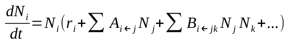
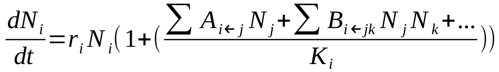
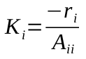

# generalized Lotka-Volterra modelling
Modelling (microbial) communities with generalized Lotka-Volterra dynamics. Two alternate forms of the equation are used, termed here as *simple gLV* and *gLV with carrying capacity* or *gLV with K*

The current simulations are temperamental and especially adding the higher-order interactions results in overflow in most cases.

#### simple gLV

Where:
- i = species i in group of species
- Ni = species i abundance
- Left side of equation = change of species i abundance per unit of time
- ri = intrinsic growth rate of species i
- Ai<-j = effect of species j on species i
- Bi<-jk = effect of species j and k on species i

#### gLV with K

Where:
- Ki is maximum carrying capacity for species i and it can be found with equation:

 

- Ktot is maximum total carrying capacity, maximum amount of bacteria the environment supports
- Ntot is the total species abundance

The model scales the species' intrinsic growth rates in relation to the species' carrying capacities so the species growth caps around their individual maximum carrying capacity unless another species affects it positively. The total per capita growth rate for each species is scaled in relation to the total maximum abundance and total maximum carrying capacity so that all species growth slows as the population approaches total maximum carrying capacity.

### Instructions
*index_simple_gLV.py* contains the code needed for initiating a one-off simulation or simple gLV. Input desired parameters to functions and run program.

*index_gLVwK.py* contains the code needed for initiating a one-off simulation or gLV with K. Input desired parameters to functions and run program.

*parameters.py* contains functions needed to create the initial values for the simulation, such as interactions between species and individual growth rates for species. In random draws the standard deviation values for pairwise interactions should be in absolute units as the default mean is 0, but for standard deviation in drawing starting abundances and intrinsic growth rates the value should be as a fraction of the mean, for example if mean is 100 CFU and wanted std is 10 CFU the input should be 0.1

*trajectories.py* contains functions needed for carrying out the simulation with the generated initial values.

*graphics.py* contains functions to visualize the generated data.

### Future developments for project
- Fix issue with frequent overflows in simulation
- Add simulation method for gLV with K
- Model birth and death rates separately in stead of ri
- Take lag times into account
- Third order interactions added to project
- Generalized high-order interactions, order specified in the function call
- Automate creating a dataset of set number of repeats with specified parameters
